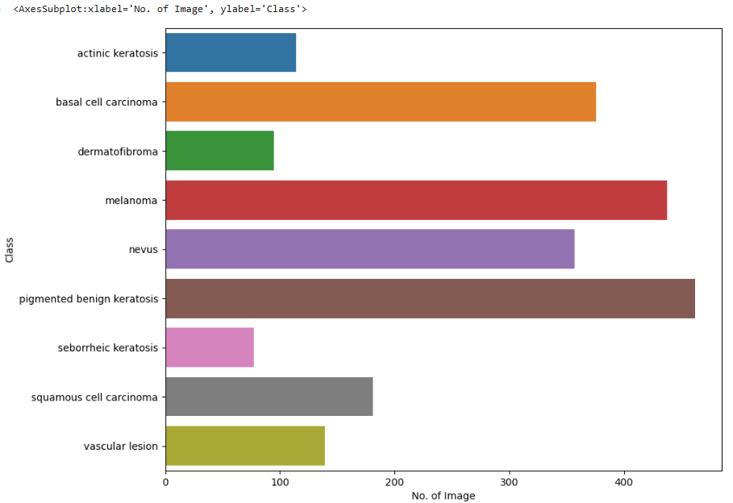

# Melanoma Skin Cancer Detection

## Abstract

Melanoma is a type of skin cancer that develops in the melanocytes, which are the cells that produce melanin, the pigment 1  that gives skin its color. While less common than other types of skin cancer, melanoma is more likely to spread to other parts of the body, making it potentially more dangerous

## Problem statement

To build a CNN based model which can accurately detect melanoma. Melanoma is a type of cancer that can be deadly if not detected early. It accounts for 75% of skin cancer deaths. A solution that can evaluate images and alert dermatologists about the presence of melanoma has the potential to reduce a lot of manual effort needed in diagnosis.

## Table of Contents

- [General Info](#general-information)
- [Model Architecture](#model-architecture)
- [Model Summary](#model-summary)
- [Model Evaluation](#model-evaluation)
- [Technologies Used](#technologies-used)
- [Acknowledgements](#acknowledgements)
- [Collaborators](#collaborators)

<!-- You can include any other section that is pertinent to your problem -->

## General Information

The dataset consists of 2357 images of malignant and benign oncological diseases, which were formed from the International Skin Imaging Collaboration (ISIC). All images were sorted according to the classification taken with ISIC, and all subsets were divided into the same number of images, with the exception of melanomas and moles, whose images are slightly dominant.

In order to address the challenge of class imbalance, the Augmentor Python package (https://augmentor.readthedocs.io/en/master/) was employed to augment the dataset. This involved generating additional samples for all classes, ensuring that none of the classes had insufficient representation.

## Pictorial representation of skin types

The aim of this task is to build a multiclass classification model using a custom convolutional neural network in TensorFlow. 

## Model Architecture

The break down of the final provided CNN architecture step by step:

1. **Normalization**: The `Rescaling(1./255)` layer is added to normalize the pixel values of the input images. Normalization typically involves scaling the pixel values to a range between 0 and 1, which helps in stabilizing the training process and speeding up convergence.

2. **Convolutional Layers**: Three convolutional layers are added sequentially using the `Conv2D` function. Each convolutional layer is followed by a rectified linear unit (ReLU) activation function, which introduces non-linearity into the model. The `padding='same'` argument ensures that the spatial dimensions of the feature maps remain the same after convolution. The number within each `Conv2D` layer (32, 64, 128) represents the number of filters or kernels used in each layer, determining the depth of the feature maps.

3. **Pooling Layers**: After each convolutional layer, a max-pooling layer (`MaxPooling2D`) is added to downsample the feature maps, reducing their spatial dimensions while retaining the most important information. Max-pooling helps in reducing computational complexity and controlling overfitting.

4. **Dropout Layer**: A dropout layer (`Dropout`) with a dropout rate of 0.5 is added after the last max-pooling layer. Dropout is a regularization technique used to prevent overfitting by randomly dropping a fraction of the neurons during training.

5. **Flatten Layer**: The `Flatten` layer is added to flatten the 2D feature maps into a 1D vector, preparing the data for input into the fully connected layers.

6. **Fully Connected Layers**: Two fully connected (dense) layers (`Dense`) are added with ReLU activation functions. The first dense layer consists of 128 neurons, and the second dense layer outputs the final classification probabilities for each class label.

7. **Output Layer**: The number of neurons in the output layer is determined by the number of classes in the classification task. An activation function softmax specified

8. **Model Compilation**: The model is compiled using the Adam optimizer (`optimizer='adam'`) and the Sparse Categorical Crossentropy loss function (`loss=tf.keras.losses.SparseCategoricalCrossentropy(from_logits=True)`), which is suitable for multi-class classification problems. Additionally, accuracy is chosen as the evaluation metric (`metrics=['accuracy']`).

9. **Training**: The model is trained using the `fit` method with the specified number of epochs (`epochs=30`). The `ModelCheckpoint` and `EarlyStopping` callbacks are employed to monitor the validation accuracy during training. The `ModelCheckpoint` callback saves the model with the best validation accuracy, while the `EarlyStopping` callback stops training if the validation accuracy does not improve for a specified number of epochs (patience=5 in this case). These callbacks help prevent overfitting and ensure that the model converges to the best possible solution.

## Results

After training the model for around 25 epochs, the following results were achieved:

- Training Accuracy: 89%
- Validation Accuracy: 85%
- Training Loss: 0.26
- Validation Loss: 0.62

The model showed significant improvement in accuracy and reduced overfitting compared to earlier versions. Class rebalancing using data augmentation played a crucial role in achieving these results.

## Conclusion

The developed CNN model demonstrates strong potential for precise skin cancer detection, including melanoma. By harnessing deep learning and data augmentation, this model can aid dermatologists in diagnosis. Future advancements can be achieved through the acquisition of more diverse and balanced datasets, along with refined model architecture.

## Model Summary

## Model Evaluation

## Technologies Used

- [Python](https://www.python.org/) - version 3.11.4
- [Matplotlib](https://matplotlib.org/) - version 3.8.0
- [Numpy](https://numpy.org/) - version 1.26.4
- [Pandas](https://pandas.pydata.org/) - version 2.2.3
- [Seaborn](https://seaborn.pydata.org/) - version 0.12.2
- [Tensorflow](https://www.tensorflow.org/) - version 2.16.1

<!-- As the libraries versions keep on changing, it is recommended to mention the version of library used in this project -->

## Acknowledgements

- UpGrad tutorials on Convolution Neural Networks (CNNs) on the learning platform

[1] Augmentor Documentation: https://augmentor.readthedocs.io/

[2] TensorFlow Documentation: https://www.tensorflow.org/

[3] Keras Documentation: https://keras.io/

## Collaborators

Created by [@akhilgarg81](https://github.com/akhilgarg81
